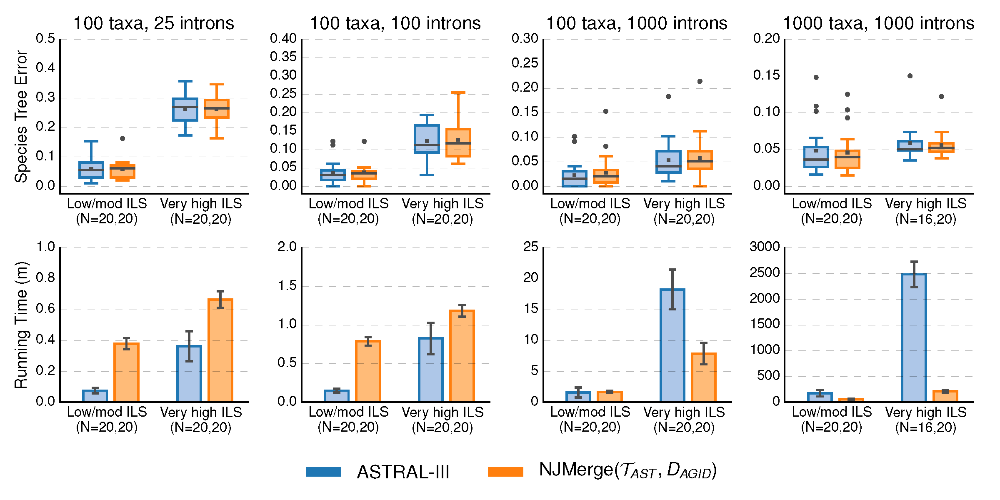

Tutorial 2: Presenting data using pandas, matplotlib, and seaborn (optional)
============================================================================
***If you are in Champaign, you should be working on this assignment as a group between 3-6pm in 3401 Siebel Center. Although you may work together, each of you should write and commit your own code to Github. Any questions/issues with the tutorial should also be posted to slack in the channel #tutorials.***

You may do this tutorial on the campus cluster or on your laptop, as long as you write code that is compatible with Python v3.7.0 and uses [pandas](https://pandas.pydata.org/), [matplotlib](https://matplotlib.org/), and [seaborn](https://seaborn.pydata.org/) (optional) modules.

If you are working on the campus cluster, type
```
cd /projects/tallis/[YourNetID]/reu2019-tutorials/3-data
mkdir [YourNetID]
cd [YourNetID]
```

For the first assignment, you will write Python code to recreate the plot below using the CSV file `data/data-species-trees.csv` [here](data/data-species-trees.csv).



Note that you should be trying to recreate the main features of the figure (for example, the sub-plots, the box and bar plots, the x/y-labels, the titles, etc.) You do not need to worry about superficial things like the numbers of the y-axis, the colors used, the exact look of the boxplot/bargraphs, etc. Please do include `N=` on the x-axis, which shows the number of replicate datasets for a specific model condition. As a bonus activity, you could re-create a version of this plot, where methods are restricted to the same set of replicates. For example, in the 1000 taxa, 1000 introns subplot, ASTRAL completes on 16 replicates with very high ILS but NJMerge completes on all 20 replicates. In this case, you could restrict NJMerge to the same 16 replicates that ASTRAL completed on and only show this data.

For the first assignment, you will write Python code to recreate the table using LaTex (booktabs package) below using the CSV file `data/data-species-trees.csv` [here](data/data-species-trees.csv).


It is very important to report failures when running analyses. This table shows all of the failures for this study by model condition, method, and replicate number. Basically, I wrote a python script that wrote latex code for this table.

I know that everyone is working at a different pace --- and that is totally expected! There are several goals of these activities: to get to know the other undergrads of our research group, to teach and learn from each other, and to have fun. Also, you are practicing skills that are useful and enabling me to give you feedback on your work --- before you get too far into a specific research project. Anyway, please commit your code at the end of the day. Also, if you have committed your code to a forked repository, etc; just let me know. I am sorry that I do not have a lot of time to look at your work right now, but we will be checking in about all of this next week! If you are having problems committing code --- just email me your files!
