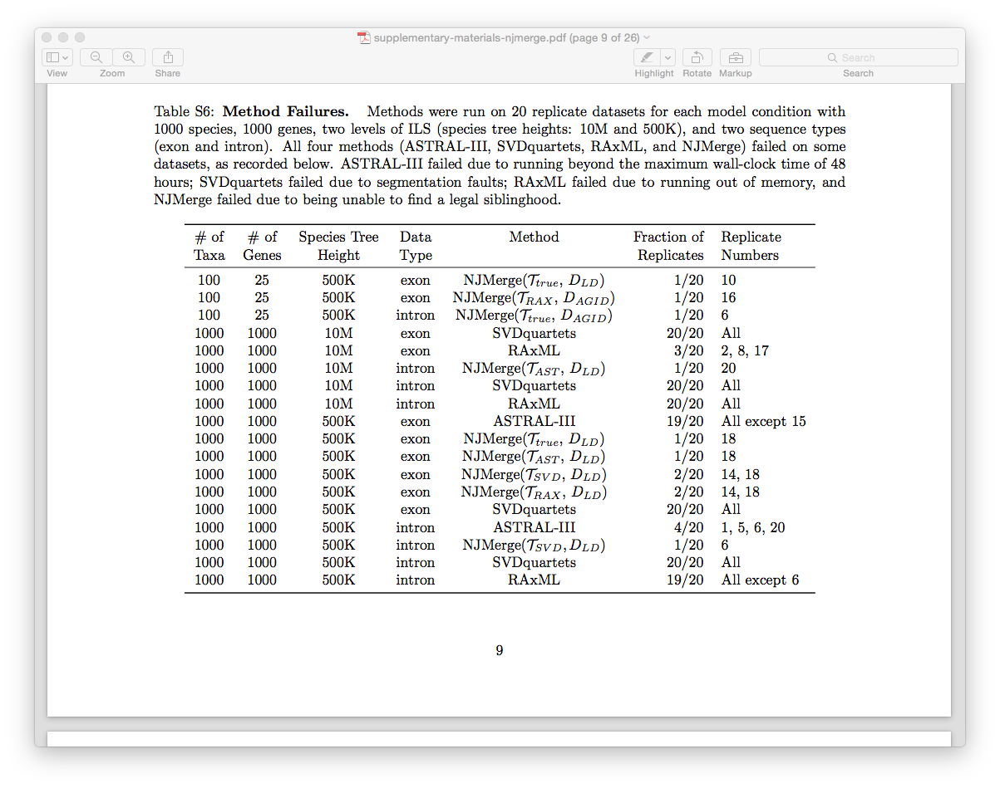

Tutorial 2: Presenting data using pandas, matplotlib, and seaborn (optional)
============================================================================
***If you are in Champaign, you should be working on this assignment as a group between 3-6pm in 3401 Siebel Center. Although you may work together, each of you should write and commit your own code to Github. Any questions/issues with the tutorial should also be posted to slack in the channel #tutorials.***

You may do this tutorial on the campus cluster or on your laptop, as long as you write code that is compatible with Python v3.7.0 and uses [pandas](https://pandas.pydata.org/), [matplotlib](https://matplotlib.org/), and [seaborn](https://seaborn.pydata.org/) (optional) modules.

